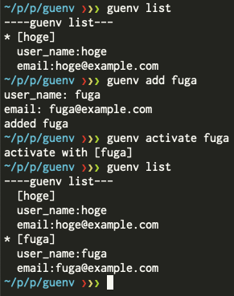

# Simple git user environment management tools: guenv
guenv is the simplest git user environemnt management tools.
Mainly, It has 2 features.
1. easily switch to git user like "pyenv"or "rbenv"
2. ~~easily replace git user in previous commit~~



# Requirements
Python (3.2<=)

# Installation
```
$ pip install guenv
```


# Usage

## 1. Switch Git User environemnt
```
$ guenv add [example1]
$ guenv list
$ guenv activate [example1]
```

After guenv activate, You can commit with [example1] config.
<!--
## 2. replace previous commit
```
$ guenv replace [example1]
```

guenv replace can rewrite the previous commiter and author.
 -->

# Commands Usage
```
Commands:
  activate  Activate git user environment
  add       Add a specific git user environment
  delete    Delete a specific git user environment
  edit      Edit a specific git user environment
  list      List all git user environment available to guenv
```

## guenv activate
```
$ guenv activate [config_name1]
activate with [config_name1]
```

## guenv add
```
$ guenv add [config_name1]
added [config_name1]
```

## guenv delete
```
$ guenv delete [config_name1]
deleted [config_name1]
```

## guenv edit
```
$ guenv edit [config_name1]
user_name(now:[old_name]): [new_name]
email(now:[old_email]): [new_email]
edited [config_name1]
```

## guenv list
```
$ guenv list
----guenv list---
  [user_hoge]
  user_name:hoge
  email:hoge@example.com
* [user_fuga]
  user_name:fuga
  email:fuga@example.com
```


## guenv_replace
```
guenv_replace [old@example.com] [new_user_name] [new@example.com]
```
